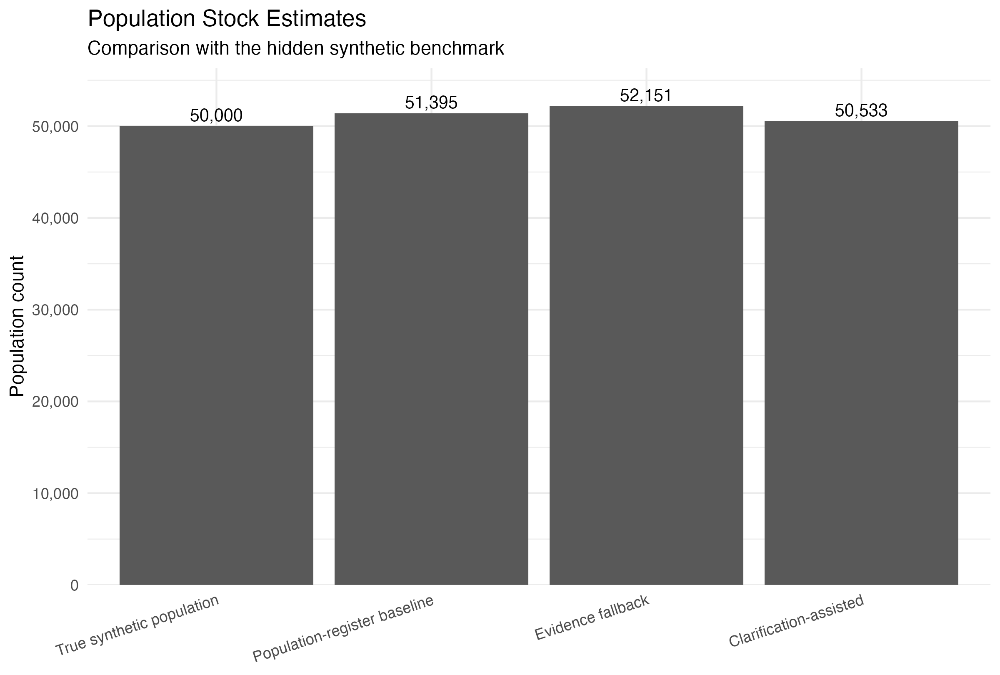
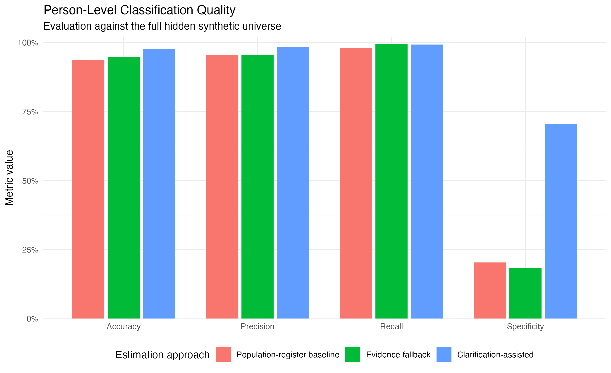

# 📊 Register-Based Population and Education Data Integration

A reproducible **Python + R** workflow for synthetic register-based population estimation, multi-source data integration, quality assurance and educational-attainment reconciliation.


---

## 🚀 Project Overview

This project develops a fully synthetic methodological workflow for **register-based population and education data integration**.

It contains two complementary analytical modules:

1. **Population module**
   - population-register undercoverage and overcoverage
   - multi-source activity signals
   - address evidence
   - population-stock estimation
   - synthetic residence clarification

2. **Education-attainment module**
   - heterogeneous person-level data deliveries
   - delivery validation and quality assurance
   - source-specific harmonisation
   - same-year evidence consolidation
   - longitudinal reconciliation
   - synthetic truth-based evaluation

The project deliberately separates the technical responsibilities of the workflow:

- **Python** generates the hidden synthetic world and imperfect observable source data.
- **R** performs the operational statistical processing, validation, integration, reconciliation, estimation and reporting.

This separation makes it possible to evaluate statistical procedures against controlled synthetic truth without allowing hidden information to become ordinary operational evidence.

The project is **not an implementation of an official Destatis production system**. All persons, addresses, source deliveries, probabilities, clarification mechanisms and results are synthetic and are intended for methodological demonstration only.

---

## 🧠 Methodological Concept

The project explores a general statistical problem:

> How can heterogeneous and imperfect person-level data sources be combined without treating any single source as automatically complete or correct?

For the population module, three types of observable evidence are combined:

1. **Population-register evidence**
   - whether a person is registered
   - registered demographic information
   - registered address

2. **Activity evidence**
   - employment activity
   - tax activity
   - education participation

3. **Address evidence**
   - source-specific administrative contact addresses
   - agreement or disagreement across auxiliary sources
   - comparison with the population-register address

Activity signals can be interpreted as synthetic **Lebenszeichen**: indications that a person appears in another administrative source.

However, the workflow deliberately avoids the rule:

> no activity signal = non-resident

Instead, missing or conflicting evidence is treated as **uncertainty that may require additional clarification**.

For the education module, heterogeneous source-specific classifications are translated into a common analytical representation. Conflicting evidence is not silently overwritten, and missing information is not interpreted as low educational attainment.

---

## 🇩🇪 Kurzbeschreibung

Dieses Projekt entwickelt einen reproduzierbaren, vollständig synthetischen Workflow zur **Integration registerbasierter Bevölkerungs- und Bildungsdaten**.

Die technische Architektur trennt bewusst zwei Aufgaben:

- **Python** erzeugt eine kontrollierte synthetische Grundgesamtheit sowie fehlerbehaftete Datenlieferungen.
- **R** übernimmt die operative Validierung, Qualitätssicherung, Harmonisierung, Datenintegration, Schätzung und Auswertung.

### Bevölkerungsmodul

Im Bevölkerungsmodul werden Informationen aus einem synthetischen Bevölkerungsregister mit Beschäftigungs-, Steuer-, Bildungsbeteiligungs- und Anschrifteninformationen verknüpft.

Aktivitätssignale können dabei als synthetische **„Lebenszeichen“** interpretiert werden.

Ein fehlendes Aktivitätssignal wird jedoch **nicht automatisch als Hinweis auf einen fehlenden Wohnsitz interpretiert**. Stattdessen werden Fälle mit unvollständigen oder widersprüchlichen Informationen transparent identifiziert und gegebenenfalls als Klärungsfälle behandelt.

Anschriftenprobleme und Unsicherheit über den Wohnstatus werden dabei bewusst voneinander getrennt.

### Bildungsmodul

Das Bildungsmodul verarbeitet heterogene synthetische Datenlieferungen zum **Bildungsstand der Bevölkerung**.

Der Workflow umfasst:

- Entgegennahme unterschiedlicher Datenlieferungen
- Schema- und Qualitätsprüfungen
- Harmonisierung unterschiedlicher Merkmalsausprägungen
- Zusammenführung auf Personenebene
- Abstimmung mehrerer Quellen innerhalb eines Berichtsjahres
- longitudinale Abstimmung zwischen Berichtsjahren
- Kennzeichnung von Klärungsfällen und fehlenden Angaben
- getrennte Evaluation anhand einer verborgenen synthetischen Referenz

Fehlende Bildungsangaben werden **nicht als niedriger Bildungsstand interpretiert**. Widersprüchliche Informationen werden nicht stillschweigend überschrieben, sondern explizit als prüfungsbedürftig gekennzeichnet.

### Bezug zur amtlichen Statistik

Der methodische Schwerpunkt liegt auf Aufgaben, die für registerbasierte amtliche Statistik relevant sind:

- Datenübernahme und Datenvalidierung
- Qualitätssicherung von Datenlieferungen
- Integration heterogener personenbezogener Quellen
- Harmonisierung unterschiedlicher Merkmalsausprägungen
- Plausibilisierung widersprüchlicher Informationen
- longitudinale Fortschreibung
- transparente Entscheidungsregeln
- reproduzierbare statistische Verarbeitung

Die verwendeten Datenquellen und Regeln sind vereinfachte synthetische Abbildungen.

Das Projekt bildet **kein offizielles Verfahren des Statistischen Bundesamtes und kein produktives Registerzensus-System** nach.

---

## 🧪 Synthetic Data Architecture

The project begins with a hidden synthetic world and generates imperfect observable data sources from it.

Simulation assumptions and random seeds are centralized in:

```text
config/simulation.yml
```

The simulation layer is implemented in:

```text
python/simulation/
```

### Hidden Synthetic Population

The population simulation contains:

- **50,000 true residents**
- **3,000 former/non-residents**
- **53,000 persons in the synthetic universe**
- **18,000 synthetic addresses**
- **12 synthetic regions**

The hidden benchmark contains information such as the true residence state and synthetic location of each person.

Hidden truth is required for controlled data generation and subsequent evaluation, but it is kept conceptually separate from observable administrative evidence.

---

## 📚 Observable Population Sources

### Population Register

Contains:

- person ID
- household and address ID
- region and municipality
- age and age group
- sex
- citizenship group
- registration status
- registration date
- last movement date

The synthetic population register deliberately contains both:

- **undercoverage** — true residents missing from the population register
- **overcoverage** — former/non-residents still represented in the register

### Address Register

Contains synthetic information about:

- address ID
- region
- municipality
- urbanicity
- address type

### Employment Register

Contains:

- employment status
- days employed during the previous 12 months
- annual employment income
- reference date
- source-specific administrative contact address

### Tax Register

Contains:

- tax filing indicator
- taxable income
- tax year
- source-specific administrative contact address

### Education Participation Register

Contains:

- enrolment indicator
- institution type
- school year
- source-specific administrative contact address

The auxiliary registers are generated independently of population-register membership.

This allows true undercoverage cases to appear in auxiliary sources even when they are absent from the population register.

The education register used here represents **current education participation / enrolment activity**. It is conceptually distinct from the educational-attainment deliveries used in the separate education module.

---

## 🔄 Workflow Pipeline

```text
                     config/simulation.yml
                              │
                              ▼
                 ┌─────────────────────────┐
                 │        Python           │
                 │   simulation.generate   │
                 └────────────┬────────────┘
                              │
                              ▼
             Hidden synthetic world and truth
                              │
                              ▼
          Imperfect observable synthetic sources
                              │
                              ▼
                     Raw CSV deliveries
                              │
              ┌───────────────┴───────────────┐
              │                               │
              ▼                               ▼
      POPULATION MODULE                EDUCATION MODULE
              │                               │
              ▼                               ▼
┌─────────────────────────────┐   ┌─────────────────────────────┐
│ 01_clean_and_validate_      │   │ 01_validate_harmonize_      │
│ registers.R                 │   │ education.R                 │
└──────────────┬──────────────┘   └──────────────┬──────────────┘
               │                                 │
               ▼                                 ▼
       Clean registers                  Validated and
       + QA indicators                  harmonised evidence
               │                                 │
               ▼                                 ▼
┌─────────────────────────────┐   ┌─────────────────────────────┐
│ 02_integrate_activity_      │   │ 02_consolidate_education_   │
│ signals.R                   │   │ attainment.R                │
└──────────────┬──────────────┘   └──────────────┬──────────────┘
               │                                 │
               ▼                                 ▼
   Person/address evidence            Person-year +
               │                     longitudinal states
               ▼                                 │
┌─────────────────────────────┐                    ▼
│ 03_estimate_population_     │   ┌─────────────────────────────┐
│ stock.R                     │   │ 03_evaluate_education_      │
└──────────────┬──────────────┘   │ attainment.R                │
               │                  └─────────────────────────────┘
               ▼
 Population estimates
 + synthetic clarification
               │
               ▼
┌─────────────────────────────┐
│ 04_visualize_results.R      │
└─────────────────────────────┘
```

---

## 🐍 Python Simulation Layer

Python owns the synthetic data-generating process.

The simulation package is divided into explicit modules:

- `world.py` — hidden synthetic population, households and addresses
- `population_sources.py` — imperfect observable population-related registers
- `education_truth.py` — hidden longitudinal educational-attainment truth
- `education_sources.py` — heterogeneous education-attainment deliveries
- `generate.py` — configuration loading, deterministic RNG ownership, orchestration and persistence

This architecture separates:

> **what is true in the synthetic world**

from

> **what each observable source is allowed to report**

The distinction is important because source imperfections can be generated from hidden truth without exposing that truth as operational input.

---

## 🎲 Deterministic Simulation

The simulation uses fixed, component-specific random-number streams.

Separate deterministic RNG streams are used for:

- address generation
- household generation
- true residents
- former residents
- population-register generation
- employment observations
- employment contact addresses
- tax observations
- tax contact addresses
- education-participation observations
- education contact addresses
- education-attainment truth
- Zensus-like attainment delivery
- BA-like attainment delivery
- Mikrozensus-like attainment delivery

Repeated generation from an unchanged configuration produces **byte-identical raw CSV files**.

This makes changes to the synthetic input layer reproducible and auditable.

---

# 👥 Population Module

## 🔍 1. Cleaning and Validation

The first R stage performs:

- schema and structural checks
- key uniqueness checks
- referential-integrity checks
- plausibility checks
- register-specific cleaning
- address validation
- cross-register consistency checks
- construction of neutral activity indicators
- identification of auxiliary-only persons

The current synthetic realization contains:

- population-register records: **51,395**
- true residents represented in the population register: **49,006**
- true population-register undercoverage: **994**
- true population-register overcoverage: **2,389**

Across all observable population sources:

- **52,200 unique persons** are observed
- **805 persons** appear only in auxiliary sources
- **800 persons** are absent from every observable source
- **267** of the completely unobserved persons are true residents

These completely unobserved residents illustrate residual undercoverage that cannot be recovered through person-level linkage of the available sources alone.

---

## 🔗 2. Multi-Source Evidence Integration

The second R stage constructs an analysis-ready person-level evidence dataset.

It combines:

- population-register presence
- employment activity
- tax activity
- education-participation activity
- auxiliary-source presence
- contact-address agreement
- contact-address conflicts
- population-register versus auxiliary-address disagreement

It also constructs analytical geography for aggregation.

For registered persons, analytical geography is based on the population register.

For auxiliary-only persons, an analytical address is used only where auxiliary sources provide sufficiently consistent information.

An analytical address is **not interpreted as verified residence**.

---

## 🧭 Activity and Address Evidence

Activity signals are treated as evidence rather than deterministic residence rules.

A person with no observed activity is therefore not automatically removed from the estimated population.

Likewise, an auxiliary contact address that differs from the population-register address is not automatically interpreted as proof that the registered residence is incorrect.

This allows the workflow to distinguish:

- residence-status uncertainty
- address inconsistency
- register undercoverage
- register overcoverage

without assuming that one source contains the definitive answer.

---

## 📐 3. Population Estimation and Synthetic Clarification

Three population-estimation approaches are compared.

### Population-Register Baseline

Every person represented in the population register is counted as resident.

### Evidence Fallback

The population-register baseline is supplemented with auxiliary-only persons where observable activity and address evidence support inclusion.

### Clarification-Assisted Estimate

Cases with increased residence-status uncertainty are identified using observable information.

The current realization identifies:

- **5,708 residence-clarification targets**

The largest target group consists of registered persons aged 18–64 without a positive auxiliary activity signal.

A synthetic clarification process then uses illustrative assumptions of:

- **90% response probability**
- **98% clarification-result accuracy**

These parameters are simulation assumptions and are **not empirical estimates for Germany**.

Absence of activity is used only as a **clarification trigger**, not as direct evidence of non-residence.

Hidden residence truth is used to simulate clarification outcomes and subsequently evaluate the methods. The clarification-assisted result should therefore be interpreted as a synthetic methodological scenario rather than a deployable operational procedure.

---

## 📈 Population-Stock Results

| Estimation approach | Estimated population | Error vs. hidden truth |
|---|---:|---:|
| Population-register baseline | 51,395 | +1,395 |
| Evidence fallback | 52,151 | +2,151 |
| Clarification-assisted | **50,533** | **+533** |
| Hidden synthetic population | 50,000 | — |

The evidence fallback recovers additional undercovered true residents, but also introduces additional false-positive inclusions.

This illustrates an important statistical distinction:

> Better recovery of undercovered individuals does not automatically imply a better aggregate population estimate.

The clarification-assisted scenario substantially reduces overcoverage while retaining very high recall.



---

## 🎯 Person-Level Estimation Quality

| Method | Accuracy | Precision | Recall | Specificity |
|---|---:|---:|---:|---:|
| Population-register baseline | 93.62% | 95.35% | 98.01% | 20.37% |
| Evidence fallback | 94.81% | 95.30% | **99.40%** | 18.33% |
| Clarification-assisted | **97.66%** | **98.24%** | 99.29% | **70.43%** |

False-positive cases are reduced from:

- **2,389** in the population-register baseline
- **2,450** in the evidence fallback

to:

- **887** in the clarification-assisted scenario

while the number of correctly identified true residents remains high.



---

# 🎓 Education-Attainment Module

The second major module addresses a related but distinct problem: integrating heterogeneous person-level information about **educational attainment**.

It is deliberately separate from the education-participation register used as an activity signal in the population workflow.

The synthetic simulation produces three attainment-source families:

- **Zensus-like 2022 delivery**
- **BA-like 2024 delivery**
- **Mikrozensus-like 2024 delivery**

These names indicate methodological source families only.

The files are synthetic abstractions and are **not replicas of actual institutional data deliveries**.

---

## 🔐 Operational / Truth Separation

A central design principle of the education module is the separation between operational evidence and hidden synthetic truth.

```text
Hidden synthetic education truth
          │
          ├──────── source generation
          │
          └──────── final evaluation
          │
          ✕
          │   not available to the
          │   operational workflow
          │
Observable synthetic deliveries
          │
          ▼
Delivery validation and QA
          │
          ▼
Source-specific harmonisation
          │
          ▼
Same-year consolidation
          │
          ▼
Longitudinal reconciliation
          │
          ▼
2024 operational attainment result
          │
          ▼
Separate truth-based evaluation
```

`synthetic_education_truth.csv` is excluded from operational validation, harmonisation and reconciliation.

Only after the operational result has been completed is hidden education truth introduced for evaluation.

---

## 📚 Synthetic Attainment Scale

The harmonised analytical scale contains six ordered synthetic levels:

1. low or none
2. school qualification
3. vocational or post-secondary
4. bachelor or equivalent
5. master or equivalent
6. doctorate

The scale is deliberately simplified.

It is **not an official Destatis or ISCED classification**.

Some observations represent exact attainment states, while others contain broader information represented as ranges.

Examples:

- precise Bachelor evidence → `4–4`
- precise Master evidence → `5–5`
- broad higher-education evidence → `4–6`
- broad school/vocational evidence → `2–3`

Representing incomplete source information as ranges allows the workflow to retain available evidence without imposing artificial precision.

---

## ✅ 1. Delivery Validation and Quality Assurance

The first education-processing stage checks:

- required delivery schemas
- missing person identifiers
- invalid reference/reporting years
- duplicate person-year observations
- missing attainment information
- unknown source codes
- validity of harmonised attainment ranges

All delivered records remain represented in the audit-oriented harmonised output.

Only records satisfying the operational QA rules proceed to reconciliation.

### Delivery QA Results

| QA outcome | Records |
|---|---:|
| Delivered | **29,939** |
| Usable | **29,114** |
| Flagged | **297** |
| Rejected | **528** |

The distinction between usable, flagged and rejected observations preserves data-quality information instead of silently discarding every imperfect record.

---

## 🔄 2. Same-Year Evidence Consolidation

The workflow deliberately avoids imposing a universal source hierarchy.

Where several usable observations exist for the same person and reference year:

- a single usable observation can be retained directly
- compatible ranges are intersected
- more precise compatible evidence can narrow a broad range
- disjoint observations become `same_year_conflict`
- conflicting observations are not widened into an artificial compromise range

The current realization contains:

- **28,491 usable target-population evidence records**
- **27,091 consolidated person-year records**
- **21 same-year conflicts**

---

## ⏳ Longitudinal Reconciliation

Person-year evidence from 2022 and 2024 is reconciled using explicit longitudinal rules.

The workflow distinguishes:

- confirmed attainment
- refinement by more precise later evidence
- upward progression
- temporal regression
- earlier evidence carried forward
- unresolved same-year conflict
- absence of usable evidence

A later state that lies entirely below a previously accepted attainment state is treated as a **temporal regression**.

It is routed to review rather than automatically replacing the earlier state.

Likewise:

> missing evidence ≠ low educational attainment

Persons without sufficient usable attainment evidence therefore receive:

```text
not_reported
```

instead of being assigned automatically to the lowest educational-attainment category.

---

## 👥 Operational Education Target Population

The education module derives its target population from **observable population evidence**.

It uses the operational evidence-based population scope rather than hidden education truth.

For the final 2024 educational-attainment result, persons must additionally have sufficient operational age information to belong to the relevant population aged 15 or older.

The final operational education target population contains:

- **43,008 persons**

### Reconciliation Results

| Final status | Persons |
|---|---:|
| Accepted | **23,323** |
| Review required | **69** |
| Not reported | **19,616** |
| **Total** | **43,008** |

The distinction between `accepted`, `review_required` and `not_reported` keeps substantive attainment information separate from data-quality and completeness problems.

---

## 🧪 3. Synthetic Education Evaluation

Hidden education truth is introduced only after the operational result has been completed.

### Population Alignment

| Measure | Persons |
|---|---:|
| Operational target population | 43,008 |
| Hidden 2024 truth population | 41,690 |
| Evaluation overlap | **40,795** |
| Operational without hidden truth | 2,213 |
| Hidden truth outside operational population | 895 |

Population-scope mismatch is evaluated separately rather than automatically counted as an attainment-classification error.

### Attainment Evaluation

Among persons with an evaluable attainment range:

- range-evaluable persons: **23,376**
- true level inside estimated range: **22,340**
- **range agreement: 95.57%**

Among persons with an exact operational attainment state:

- exact-state persons: **11,096**
- exact matches: **10,199**
- **exact-state agreement: 91.92%**

These values are **synthetic consistency measures**.

They are not estimates of the quality of actual administrative education data.

---

## 📁 Repository Structure

```text
register-population-estimation/
│
├── config/
│   └── simulation.yml
│
├── python/
│   └── simulation/
│       ├── __init__.py
│       ├── world.py
│       ├── population_sources.py
│       ├── education_truth.py
│       ├── education_sources.py
│       └── generate.py
│
├── R/
│   ├── 01_clean_and_validate_registers.R
│   ├── 02_integrate_activity_signals.R
│   ├── 03_estimate_population_stock.R
│   ├── 04_visualize_results.R
│   │
│   └── education/
│       ├── education_helpers.R
│       ├── 01_validate_harmonize_education.R
│       ├── 02_consolidate_education_attainment.R
│       └── 03_evaluate_education_attainment.R
│
├── data/
│   ├── raw/
│   ├── clean/
│   ├── processed/
│   │
│   └── education/
│       ├── raw/
│       ├── clean/
│       └── processed/
│
├── output/
│   ├── figures/
│   ├── tables/
│   └── education/
│       └── tables/
│
├── tests/
│   ├── python/
│   │   ├── test_world.py
│   │   ├── test_population_sources.py
│   │   ├── test_education_truth.py
│   │   ├── test_education_sources.py
│   │   ├── test_generate.py
│   │   └── test_simulation_imports.py
│   │
│   └── test_education_helpers.R
│
├── .python-version
├── pyproject.toml
├── uv.lock
├── LICENSE
└── README.md
```

---

## 📄 Main Output Tables

### Population Workflow

The population workflow generates:

- `population_estimation_overall.csv`
- `population_estimation_by_region.csv`
- `population_estimation_by_age_group.csv`
- `estimation_quality_summary.csv`
- `clarification_summary.csv`

The final person-level estimation dataset is written to:

- `data/processed/person_population_estimate.csv`

### Education Workflow

Delivery QA and reconciliation outputs include:

- `education_delivery_qa_summary.csv`
- `education_population_scope_summary.csv`
- `education_reconciliation_summary.csv`
- `data/education/processed/education_attainment_person_year.csv`
- `data/education/processed/education_attainment_2024.csv`

Synthetic evaluation outputs include:

- `education_population_alignment_summary.csv`
- `education_attainment_evaluation_summary.csv`
- `education_evaluation_by_status.csv`
- `education_evaluation_by_decision_reason.csv`

---

## 📊 Main Figures

The population workflow produces:

- `activity_signal_distribution.png`
- `address_evidence_distribution.png`
- `population_estimates_overall.png`
- `estimation_error_by_region.png`
- `estimation_quality_by_method.png`
- `residence_clarification_targets.png`

The README highlights the two figures that most directly summarize the aggregate and person-level population-estimation results.

---

## 🛠 Technologies Used

The project uses **Python and R for distinct responsibilities**.

### Python — Synthetic Data Simulation

Main technologies:

- **Python 3.12**
- **NumPy** — deterministic random generation and numerical operations
- **pandas** — tabular simulation and data persistence
- **PyYAML** — configuration loading
- **pytest** — automated testing
- **uv** — environment and dependency management

### R — Statistical Processing

Main packages:

- **dplyr** — data transformation and integration
- **readr** — data input/output
- **janitor** — data cleaning and variable-name standardisation
- **tidyr** — reshaping for reporting
- **ggplot2** — visualisation

The education reconciliation module additionally uses explicit base-R helper functions and scenario tests.

### Development and Reproducibility

- Git
- GitHub
- signed Git commits
- configuration-driven simulation
- deterministic random-number streams
- explicit raw-data output contracts
- automated Python tests
- end-to-end R workflow validation

---

## 🧪 Testing

The Python simulation layer currently contains:

- **109 automated tests**

The test suite covers:

- synthetic world construction
- population-source generation
- educational-attainment truth
- heterogeneous education-source generation
- schema and output contracts
- deterministic RNG ownership
- orchestration
- persistence safeguards
- complete simulation-output generation

The education reconciliation rules are additionally tested with:

```text
tests/test_education_helpers.R
```

The current Python-generated synthetic realization has also been processed successfully through the complete population and education R workflows.

---

## ▶️ How to Run

Run all commands from the repository root.

### 1. Install the Python Environment

The project requires:

```text
Python >= 3.12, < 3.13
```

Create/synchronise the environment with:

```bash
uv sync
```

### 2. Generate Synthetic Raw Data

```bash
uv run python -m simulation.generate
```

The generator writes the complete synthetic raw-data layer for both project modules.

Population-related raw files include:

```text
data/raw/synthetic_population_truth.csv
data/raw/address_register.csv
data/raw/population_register.csv
data/raw/employment_register.csv
data/raw/tax_register.csv
data/raw/education_register.csv
```

Education-attainment files include:

```text
data/education/raw/synthetic_education_truth.csv
data/education/raw/zensus_2022_like_delivery.csv
data/education/raw/ba_2024_like_delivery.csv
data/education/raw/mikrozensus_2024_like_delivery.csv
```

### 3. Run the Population Workflow

```bash
Rscript R/01_clean_and_validate_registers.R
Rscript R/02_integrate_activity_signals.R
Rscript R/03_estimate_population_stock.R
Rscript R/04_visualize_results.R
```

### 4. Run the Education Workflow

```bash
Rscript R/education/01_validate_harmonize_education.R
Rscript R/education/02_consolidate_education_attainment.R
Rscript R/education/03_evaluate_education_attainment.R
```

### 5. Run Python Tests

```bash
uv run pytest -q
```

Expected current result:

```text
109 passed
```

### 6. Run Education Helper Tests in R

```bash
Rscript tests/test_education_helpers.R
```

---

## ♻️ Reproducibility

The project uses fixed configuration and deterministic random-number streams.

With an unchanged environment and `config/simulation.yml`, repeated Python generation produces the same raw synthetic realization.

The analytical workflow is then applied sequentially:

```text
configuration
      ↓
Python simulation
      ↓
raw synthetic sources
      ↓
R validation and QA
      ↓
integration / reconciliation
      ↓
population and education outputs
      ↓
synthetic evaluation
```

This provides a transparent separation between:

- assumptions
- generated source data
- operational processing
- evaluation
- reporting

---

## 📚 Methodological Context

The project is motivated by methodological challenges discussed in German register-based official statistics.

Particularly relevant themes include:

- use of heterogeneous administrative and statistical sources
- population-register undercoverage and overcoverage
- additional administrative evidence for population statistics
- person-level data integration
- quality assurance of incoming deliveries
- integration of educational-attainment information from multiple sources
- harmonisation of different source classifications
- use of longitudinal information
- explicit treatment of uncertainty and missing information

Relevant methodological background includes:

- **Grimm, Eva; Herzog, Olga; Rheiner, Sarah (2022): _Das Bildungsmodul des Registerzensus_. WISTA – Wirtschaft und Statistik, 4/2022.**
- **Söllner, René; Körner, Thomas (2022): _Der Registerzensus: Ziele, Anforderungen und Umsetzungsansätze_. WISTA – Wirtschaft und Statistik, 4/2022.**
- **Statistisches Bundesamt (Destatis): _Wie funktioniert der Registerzensus?_**
- **Statistisches Bundesamt (Destatis): _Die Methode hinter dem Zensus 2022_.**

These publications provide **methodological context and inspiration only**.

The source systems, classifications, algorithms, simulation parameters and outputs in this repository were constructed independently for this synthetic portfolio project.

No claim is made that the implemented rules reproduce the official Registerzensus, Zensus 2022 or educational-module methodology.

---

## ⚠️ Methodological Scope and Limitations

This repository is a synthetic methodological demonstration.

Key limitations include:

- simulation parameters are illustrative rather than empirically estimated for Germany
- administrative sources are simplified representations of real systems
- synthetic person identifiers allow deterministic linkage
- no probabilistic record linkage is required
- clarification outcomes are simulated
- hidden residence truth is required for the synthetic clarification experiment and evaluation
- some true residents are absent from every observable data source
- auxiliary-only persons can lack operational demographic information required for some analyses
- the educational-attainment scale is simplified and synthetic
- the scale is not an official ISCED or Destatis production classification
- education-source mappings and delivery-error rates are illustrative
- the education module does not model the full institutional, legal or IT infrastructure of a statistical register
- no real personal or administrative data are used
- the workflow does not reproduce the institutional or production architecture of official German population statistics

The project should therefore be interpreted as an applied exercise in:

**data integration · statistical quality assurance · harmonisation · reproducibility · uncertainty handling · population estimation**

rather than as a replication of an official statistical procedure.

---

## 🔭 Possible Extensions

Potential methodological extensions include:

- sensitivity analysis of clarification-response and accuracy assumptions
- additional synthetic administrative data sources
- richer temporal activity histories
- additional educational-attainment reference years
- more detailed educational classifications
- alternative uncertainty and reconciliation rules
- longitudinal population-stock estimation
- probabilistic record linkage
- privacy-preserving linkage approaches
- explicit uncertainty propagation
- expanded automated validation of incoming data deliveries

These extensions are intentionally outside the current project scope.

---

## 📘 License

MIT License

---

## 👤 Author

**Golib Sanaev**<br>
Applied Data Scientist | Official Statistics | Econometrics

**GitHub:** https://github.com/gsanaev<br>
**Email:** gsanaev80@gmail.com<br>
**LinkedIn:** https://www.linkedin.com/in/golib-sanaev/

This project was developed as a portfolio demonstration of reproducible multi-source data integration, statistical quality assurance, harmonisation and population-estimation methods using fully synthetic data.